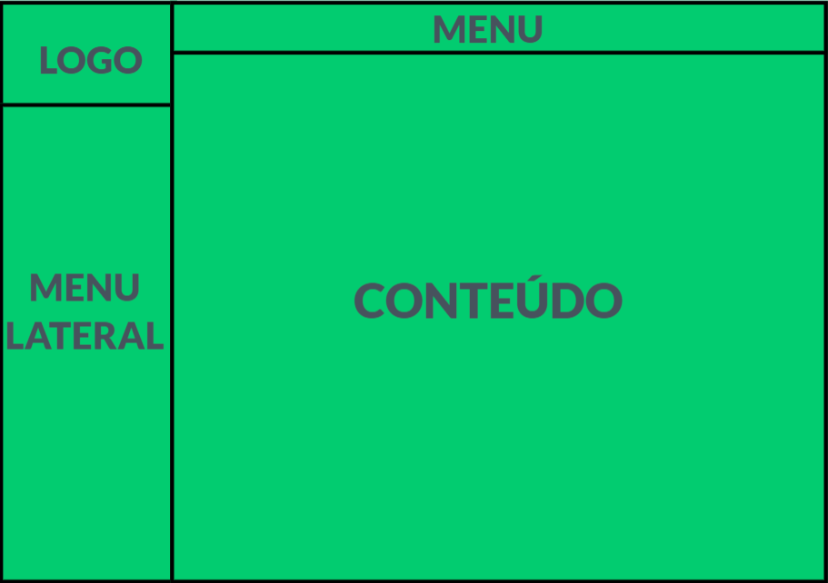

<M1>Template do Site</M1>
## WIRE FRAME
  
Figura X - Template padrão do site

Tela Principal

Modal de Mensagens
Este layout é utilizado para exibição de mensagens do sistema nos diversos locais.

Tela de Visualização de Notícias
Local onde são exibidas as notícias gerais e de cada uma das categorias.
